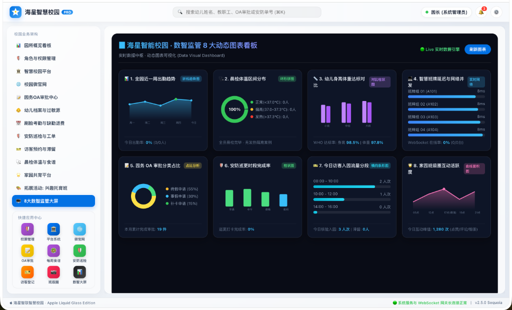

# 🌐 海星智联智慧校园系统 (StarLink Campus)

> **基于 Spring Boot 3 + Vue 3 + 苹果 Liquid Glass 设计系统的全场景智慧校园与幼儿园综合管理平台**



[](https://spring.io/projects/spring-boot)
[](https://vuejs.org/)
[](https://baomidou.com/)
[](https://apple.com)
[](LICENSE)

---

## 📌 项目简介

> **🎉 近期版本里程碑 (中期阶段已完成)**
> - **问卷聚合升级**: 采用 MySQL 原生 `JSON_EXTRACT` 下推聚合，消除 OOM 隐患。
> - **多媒体成长档案**: 扩展了 `KgGrowthRecord` 架构，全面支持家长端视频沉浸播放。
> - **微信生态接驳**: 集成 `WxJava`，全面启用公众平台模板推送与小程序 JSAPI 支付骨架。
> - **家校OA闭环**: 家长在小程序请假通过后，自动在后台生成 `KgStudentAttendance` 考勤请假记录。

**海星智联智慧校园系统 (StarLink Campus)** 是一套专为学前教育（幼儿园）与智慧校园场景量身打造的软硬件一体化综合管理平台。系统全盘引入 **Apple macOS Sequoia / iOS Liquid Glass 极简透光毛玻璃美学设计系统**，全面涵盖招投标规范中的 **15 大核心业务子系统**。

平台通过私有化 AI 人脸识别引擎（CompreFace）、21.5 寸 RK3288 智慧班牌 WebSocket 0 延时网关广播、全员过敏源交叉比对引擎、月度伙食费自动计算退费算子、4 大子模块旗舰园务 OA 系统、微信跨端小程序以及 8 大数智监管动态图表看板，实现了“人-机-园区”全场景的数字化赋能。

---

## 🌟 25 大核心功能模块 100% 齐全清单

1. **智慧班牌终端（硬件）**：支持 21.5 寸 1080P RK3288 Android 7.1 WebView 沉浸壳与 JNI 串口 IC/ID 读卡器。
2. **智慧班牌资源管理平台**：全网 WebSocket 0 延时广播，包含班级活动排期、食谱、教职名片、成长之星与全园紧急广播。
3. **管理服务器**：Docker 容器化编排架构（MySQL 8.0, Redis 7.0, MinIO, CompreFace）。
4. **智慧校园平台系统 (`/system`)**：包含【园区组织结构】树形节点管理与系统管理员/园长/班主任/保健医【角色权限配置】。
5. **校园门户网站/微官网 (`/portal`)**：包含微官网新闻发布、浏览量与微信分享统计、家长评论在线审核。
6. **园务管理系统（OA审批）(`/oa`)**：包含流程审批中心（带有 `申请➔组长➔园长` 可视化节点追踪）、园务日程与会议排期、全员公文通知一键微信催读、后勤物资申领与库存告警 4 大子模块。
7. **校园考勤系统（幼儿）(`/attendance`)**：刷脸/IC卡打卡、体温判定、**月缺勤>5天按20元/天自动计算退伙食费**算子、考勤报表。
8. **校园考勤系统（教职工）**：班级刷脸与移动端 GPS 定位打卡、多班次排班与出勤率统计。
9. **校园安防系统（巡检）(`/patrol`)**：24 个巡更点位打卡、防伪时间戳水印、设备故障**自动转换后勤维修工单**。
10. **校园安防系统（访客）(`/visitor`)**：线上二维码预约、入园扫码核验、**超时 15 分钟滞留红色警报**。
11. **卫生保健系统 (`/health`)**：晨检体温发热预警、每周食谱与**全员幼儿过敏源档案交叉比对引擎**。
12. **家园共育（班级圈）(`/family`)**：班级圈日常动态发布（图文/视频）、点赞评论与敏感词过滤。
13. **家园共育（通讯录）**：园区教职工与学生加密通讯录，支持安全虚拟呼叫。
14. **家园共育（通知公告）**：微信模板消息定向推送、家长已读/未读状态统计与一键催读。
15. **数智监管系统 (`/bigscreen`)**：**全量 8 大动态图表可视化大屏看板**（折线趋势图、环形饼图、对比柱状图、条形图等）。
16. **学生成长档案 (`/growth`)**：家长端按时间轴展示，一键生成学期发展评估报告。
17. **在线缴费与账单 (`/fee`)**：支持活动费/保教费账单发布，家长端展示待缴与历史，管理端漏斗式收缴率统计。
18. **接送人安全管理 (`/pickup`)**：核心安全机制，支持人脸/IC卡绑定，状态审核，异常人员非授权预警。
19. **每周食谱管理 (`/menu`)**：支持每日多餐别菜谱，含营养备注，可与学生过敏原信息深度联动检查。
20. **教学周计划 (`/plan`)**：教师端编辑发布本周主题与户外安排，实现透明家园共育。
21. **问卷调查与满意度 (`/survey`)**：灵活的问卷下发引擎，支持单选/多选/评分等多种题型与交叉统计。
22. **招生管理 (`/enrollment`)**：招生报名数据流转，漏斗模型统计意向到录取的转化率。
23. **教职工薪酬查询 (`/salary`)**：教职工专属通道，薪资明细一键查阅（强制本人鉴权）。
24. **视频监控预留接口**：预留 `LiveStreamService`，未来可平滑接入大华/海康威视等硬件推流。
25. **AI 自动化辅助与安全网关套件 (`/ai`)**：
    - **统一 AI 通信网关 (`AiGatewayService`)**：基于 `@Async` 异步解耦与 3-5s 熔断降级机制，支持通义千问等国内合规 API。
    - **高价值场景 1（晨检视觉分析）**：多模态视觉模型辅助检测手足口病（口腔疱疹、手掌红点）及眼部异常。
    - **高价值场景 2（内容安全风控）**：接入大模型做语义级文本审核与多模态违规图片检测。
    - **高价值场景 3（智能评语/润色）**：教师短关键词一键生成/润色温情、专业的家长沟通通知与学期期末评语。
    - **高价值场景 4（食谱营养分析）**：自动校验每日食谱营养达标率与过敏原警告提示。
    - **智能园秘 RAG 知识库 (`/ai-knowledge`)**：园区作息、退费规则等制度在线智能问答。

---

## 🎨 苹果 Sequoia 极简高级 UI 特色

- **专属海星品牌 LOGO 徽标**：顶栏左侧设计了渐变蓝色微光底座，嵌入璀璨 5 角海星矢量标志（Vector Badge）。
- **全局搜索框 (⌘K)**：支持快捷检索幼儿姓名、教职工、OA 审批与安防单号。
- **🔔 消息提醒中心**：实时调起晨检发热预警、待处理 OA 审批与访客滞留告警。
- **⚙️ 偏好设置面板**：支持晨检警告阈值（37.3℃）、缺勤退费算子（20元/天）与 Liquid Glass ↔ 高对比度模式切换。

---

## 📱 跨端微信小程序 (`starlink-campus-app`)

项目内置完整的家长/教师双端微服务小程序工程：
- **👨‍👩‍👧 家长模式**：孩子晨检体温卡（36.5℃ 正常）、🎫 动态二维码出入接送卡、在线请假、每日食谱。
- **👩‍🏫 教师工作台**：实到/应到人数监控、体温一键补录、班级圈发布、📍 教职工 GPS 考勤打卡、移动 OA 审批。

---

## 🛠️ 技术选型与运行启动

### 1. 后端 (Spring Boot 3.2 + Maven)
```bash
cd starlink-campus-backend
mvn clean compile
mvn spring-boot:run
```
API 服务端口：`http://localhost:8080/api`

### 2. 前端管理后台 (Vue 3 + Vite 5 + Element Plus)
```bash
cd starlink-campus-admin-ui
npm install
npm run dev
```
管理后台访问：`http://localhost`

### 3. 21.5 寸智慧班牌 UI (Vue 3 + WebSocket)
```bash
cd starlink-campus-board-ui
npm install
npm run dev
```
智慧班牌访问：`http://localhost:3000`

### 4. 微信小程序 (Uni-App / Vue 3)
微信开发者工具直接导入目录：`/Users/oraclez/Desktop/zwf/StarLink Campus/starlink-campus-app`

---

## 📖 相关文档目录
- 📘 [权威技术架构白皮书](file:///Users/oraclez/Desktop/zwf/StarLink%20Campus/docs/technical_architecture_whitepaper.md)
- 📙 [全量功能开发与验收交付记录](file:///Users/oraclez/.gemini/antigravity/brain/3db9d289-9436-47fd-a24b-29bb0b436066/walkthrough.md)
- 📗 [21.5寸智慧班牌硬件沉浸壳配置指南](file:///Users/oraclez/Desktop/zwf/StarLink%20Campus/docs/board_kiosk_guide.md)
- 📱 [家长/教师微信小程序使用说明](file:///Users/oraclez/Desktop/zwf/StarLink%20Campus/starlink-campus-app/README.md)

---
© 2026 海星智联科技有限公司 版权所有
