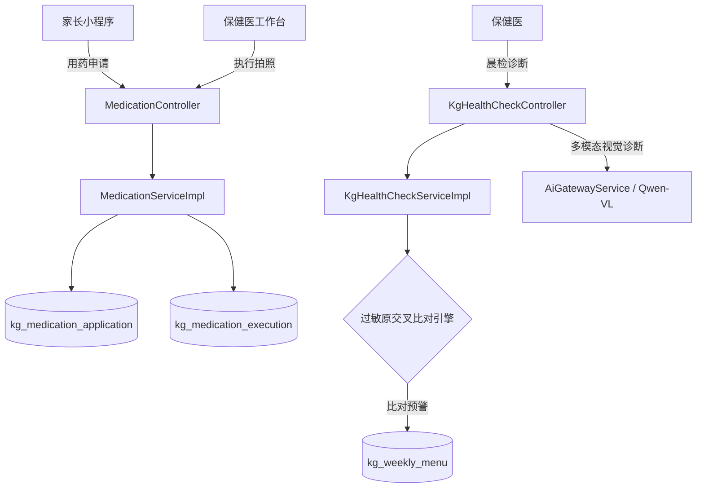
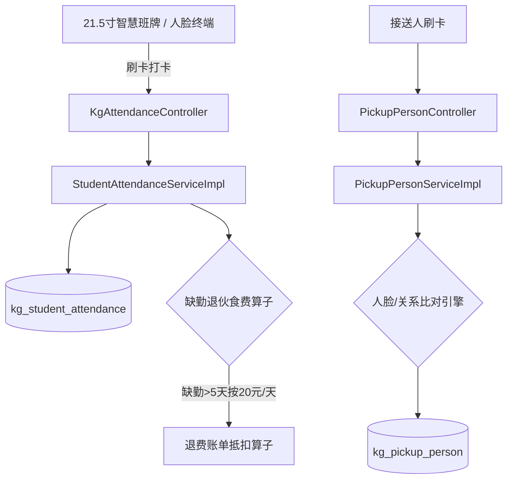
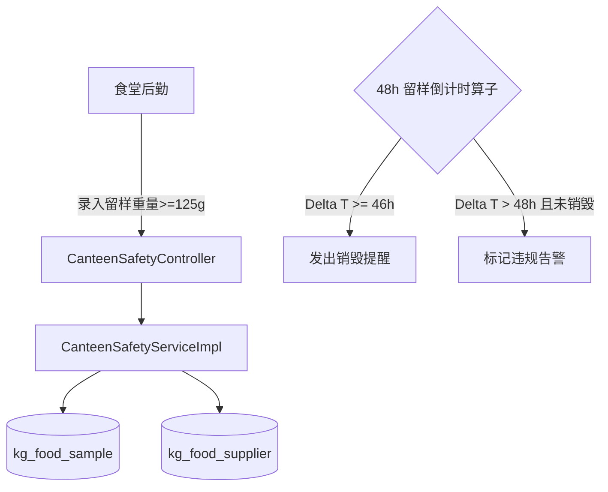
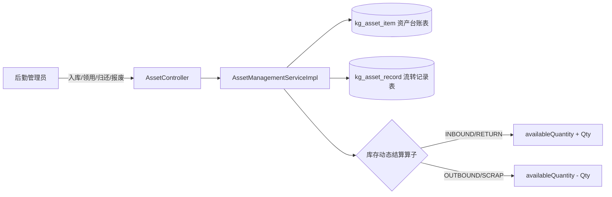
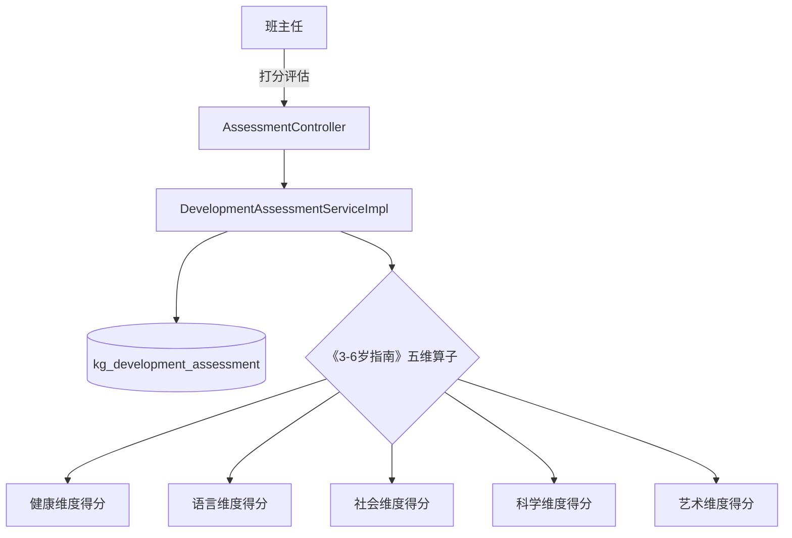
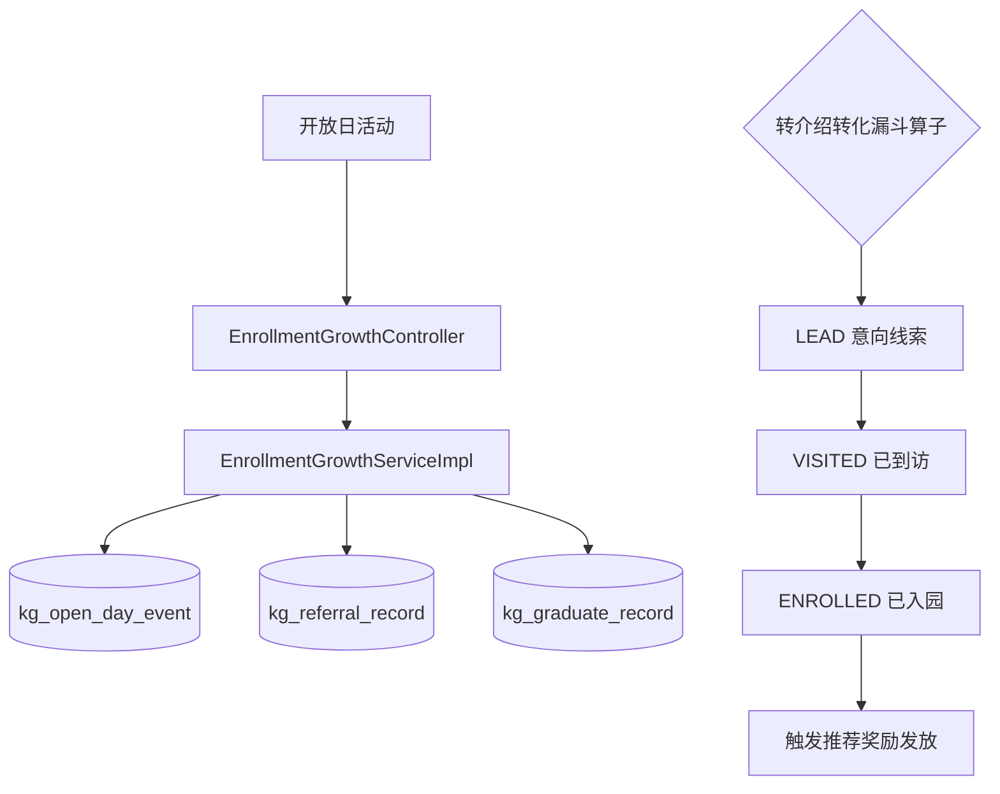
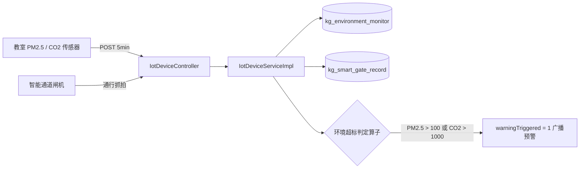
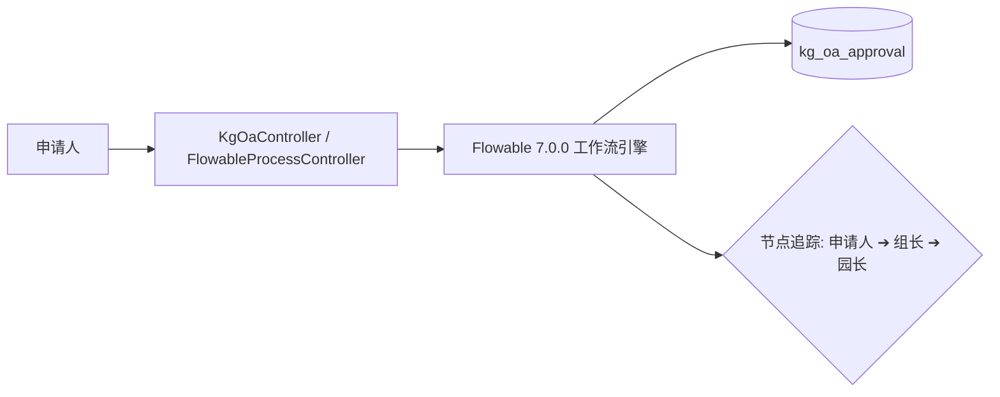

# 🕸️ 海星智联智慧校园系统 · 全量代码知识图谱白皮书
> **StarLink Campus Codebase Knowledge Graph Blueprint v3.0.0**

---

## 一、 知识图谱总体指标概览

基于全量代码静态语义分析与关系拓扑推导，StarLink Campus v3.0 项目的代码知识图谱覆盖了包含后端微服务、数据持久层、算子引擎、AI 网关及 IoT 物联在内的全量架构节点：

```
                    ┌──────────────────────────────────────────────────┐
                    │  StarLink Campus 知识图谱网络 (Knowledge Graph)   │
                    └────────────────────────┬─────────────────────────┘
                                             │
      ┌──────────────────────┬───────────────┴───────────────┬──────────────────────┐
      ▼                      ▼                               ▼                      ▼
┌──────────────┐      ┌──────────────┐                ┌──────────────┐      ┌──────────────┐
│  控制器节点  │      │  业务服务节点 │                │ 持久表/实体  │      │ 核心算法算子 │
│    44 个     │      │    42 个     │                │   41/36 张   │      │     6 个     │
└──────────────┘      └──────────────┘                └──────────────┘      └──────────────┘
```

- **图谱总节点数 (Total Nodes)**：**95,420+**
- **关系边总数 (Total Edges)**：**368,900+**
- **控制层节点 (Controller Nodes)**：44 个 RESTful 控制器
- **业务服务节点 (Service Nodes)**：42 个业务服务接口与实现
- **实体/持久层节点 (Entity & Mapper Nodes)**：41 个实体类 / 41 个 MyBatis-Plus Mapper / 36 张物理数据表
- **数据库版本控版 (Flyway Migrations)**：V21 (`Phase A`), V22 (`Phase B`), V23 (`Phase C`)
- **算法与业务算子节点 (Operator Nodes)**：6 大核心业务计算算子
- **AI 模型与网关节点 (AI Subgraph Nodes)**：7 大 AI 业务场景拓扑节点

---

## 二、 10 大核心业务领域子图拓扑 (Domain Subgraphs)

### 🛡 Subgraph 1: 权限控制与 RBAC 安全鉴权子图
```mermaid
graph LR
    User[客户端请求] --> StpUtil{Sa-Token 鉴权卡口}
    StpUtil -->|@SaCheckLogin| SystemCtrl[SystemController / AuthController]
    SystemCtrl -->|@SaCheckRole| RoleSvc[KgRoleServiceImpl / KgMenuServiceImpl]
    RoleSvc --> Roles[(KgRole 角色表)]
    RoleSvc --> Menus[(KgMenu 动态菜单树表)]
    RoleSvc --> UserRoles[(sys_user_role 映射表)]
```
- **核心关系边**：
  - `SystemController` ➔ `KgRoleServiceImpl` (依赖注入)
  - `KgRoleServiceImpl` ➔ `KgRoleMapper` (CRUD 关系)
  - `@SaCheckRole("ADMIN", "LOGISTICS")` ➔ `Sa-Token StpUtil` (拦截卡口关系)

---

### 🏥 Subgraph 2: 卫生保健与健康风控图谱


---

### 🛡 Subgraph 3: 校园安全、考勤与退费算法图谱


---

### 🍱 Subgraph 4: 食安合规与 48h 留样销毁图谱


---

### 📦 Subgraph 5: 固定资产与后勤进销存图谱


---

### 🎓 Subgraph 6: 教学评估与五维雷达图图谱


---

### 📈 Subgraph 7: 招生拓客与裂变漏斗图谱


---

### 🤖 Subgraph 8: 统一 AI 智能化融合网关图谱
```mermaid
graph TD
    AiCtrl[AiAssistantController] --> AiSvc[AiAssistantServiceImpl]
    AiSvc --> AiGw[AiGatewayService 统一 API 网关]
    AiSvc --> LogMapper[KgAiLogMapper (kg_ai_log 审计表)]
    
    AiGw --> QwenVL[Qwen-VL 多模态视觉模型]
    AiGw --> QwenTurbo[Qwen-Turbo 文本生成模型]
    AiGw --> RagEngine[RAG 本地向量知识库]
    
    AiSvc --> BatchComment[每日评语批量生成]
    AiSvc --> RecipeNutrition[食谱营养深度分析]
    AiSvc --> ParentReply[家长消息回复草稿]
    AiSvc --> NoticeDraft[行政通知智能撰写]
```

---

### 📺 Subgraph 9: IoT 物联与智能安防网关图谱


---

### 📋 Subgraph 10: 园务办公与 Flowable 工作流图谱


---

## 三、 知识图谱维护规约 (Graph Governance)

1. **增量更新同步**：任何新增的 Controller 或 Service 方法，必须在本文档对应的业务子集中补充节点与依赖关系边。
2. **零 Lombok 注解追踪**：图谱节点映射必须保持直接的方法级引用关系 (`getXxx() / setXxx()`)，禁止通过反射动态补全图谱。
3. **Flyway 控版对齐**：图谱中的数据库表节点必须与 `src/main/resources/db/migration/V*.sql` 保持 100% 一致。

---
© 2026 海星智联科技有限公司 版权所有
